## SC3 paper figures
This repository contains scripts for recreation of the figures from the SC3 paper.

### Required R libraries

[cowplot](https://cran.r-project.org/web/packages/cowplot/index.html)  
[dplyr](https://cran.r-project.org/web/packages/dplyr/index.html)  
[googleVis](https://cran.r-project.org/web/packages/googleVis/index.html)  
[pheatmap](https://cran.r-project.org/web/packages/pheatmap/index.html)

### Fig. 1
[data_c](data/1c.csv)  
[script](1c.R)  
[pdf](pdf/1c.pdf)

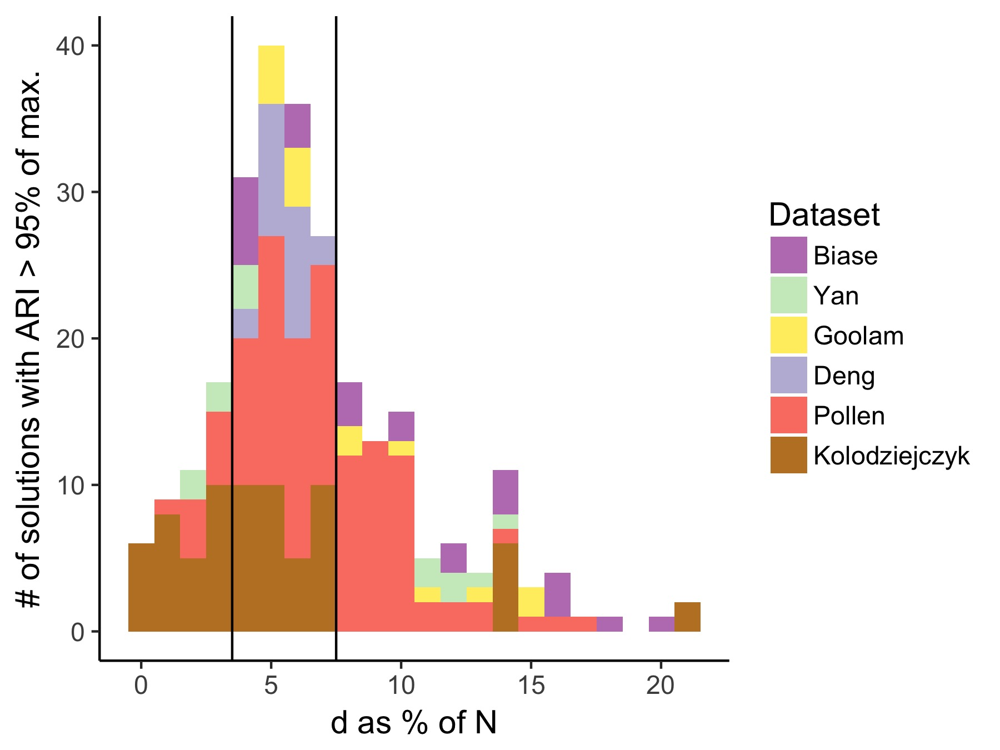

[data_d](data/1d.csv)  
[script](1d.R)  
[pdf](pdf/1d.pdf)

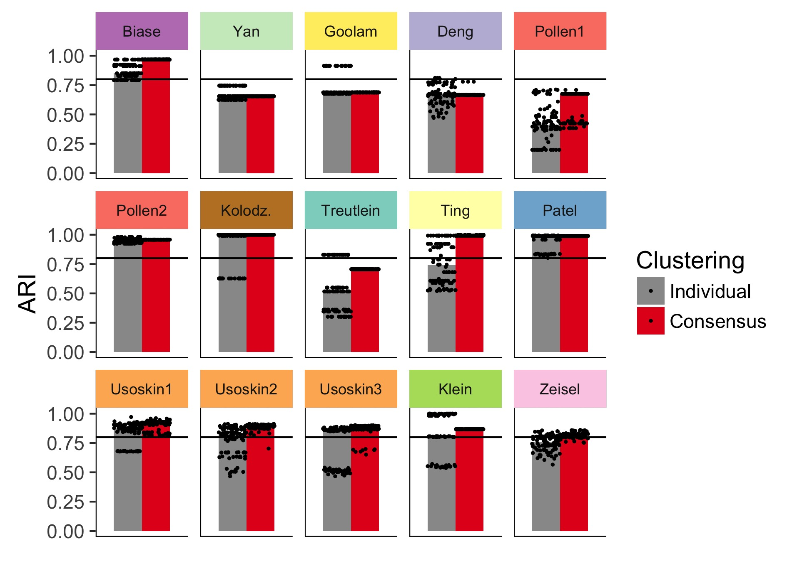

### Fig. 2
[data_a](data/2a.csv)  
[data_c](data/2c.csv)  
[data_d](data/2d.csv)  
[script](2.R)  
[pdf](pdf/2.pdf)

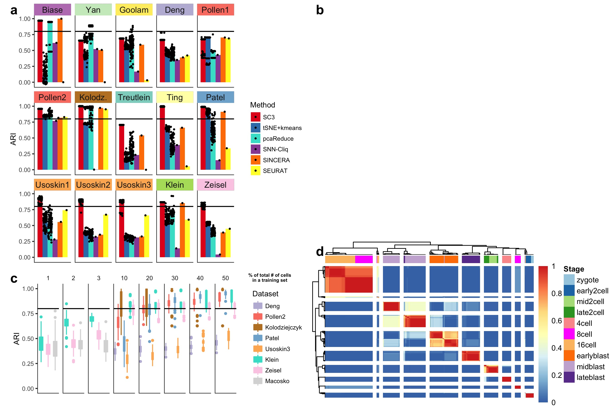

### Fig. 3
[data](data/3.csv)  
[script](3.R)  
[pdf](pdf/3.pdf)


### Fig. S1

[data](data/S1.csv)  
[script](S1.R)


### Fig. S2

[data](data/S2.csv)  
[script](S2.R)

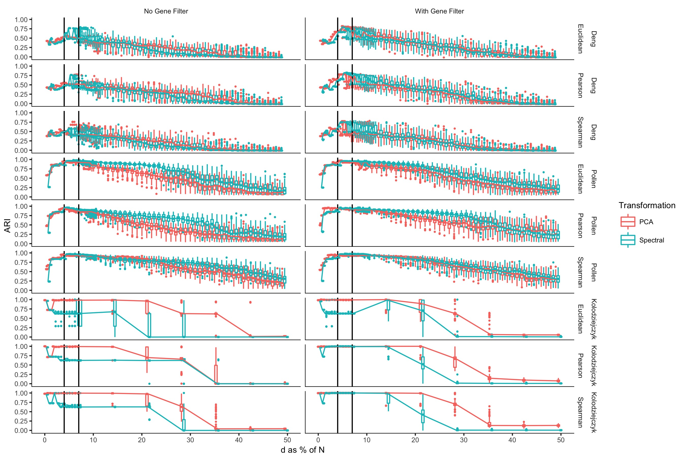

### Fig. S3
[data_a](data/S3a.csv)  
[data_b](data/S3b.csv)  
[data_c](data/S3c.csv)  
[data_d](data/S3d.csv)  
[script](S3.R)

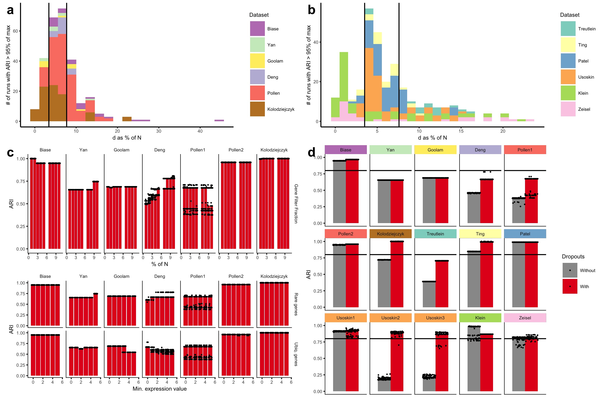

### Fig. S4
[data_a](data/S4a.csv)  
[data_b](data/S4b.csv)  
[data_c](data/S4c.csv)  
[data_d](data/S4d.csv)  
[data_e](data/S4e.csv)  
[script](S4.R)

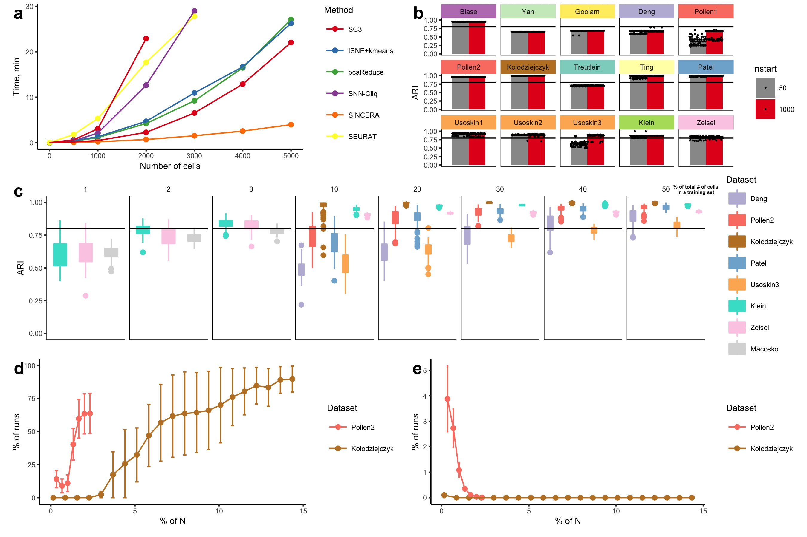

### Fig. S5
[data_a](data/S5a.csv)  
[script_a](S4a.R)  
[pdf_a](pdf/S5a.pdf)  

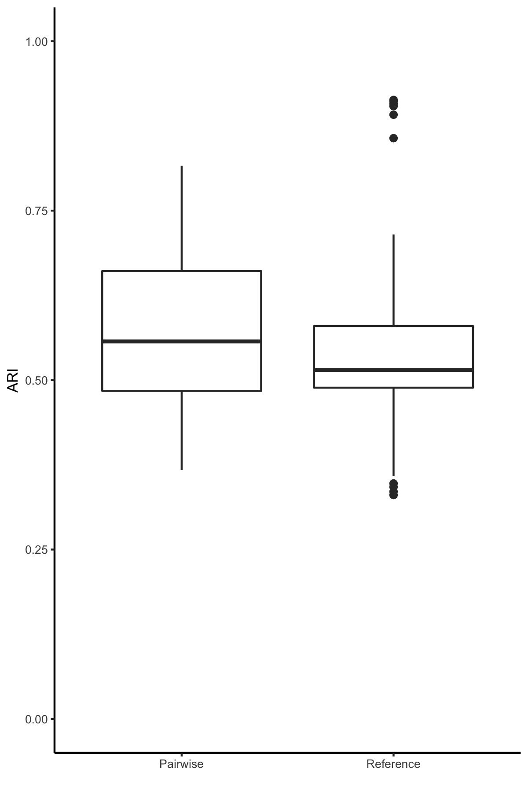

[data_b](data/S5b.csv)  
[html_b](data/S5b.html)  
[script_b](S4b.R)  
[pdf_b](pdf/S5b.pdf)

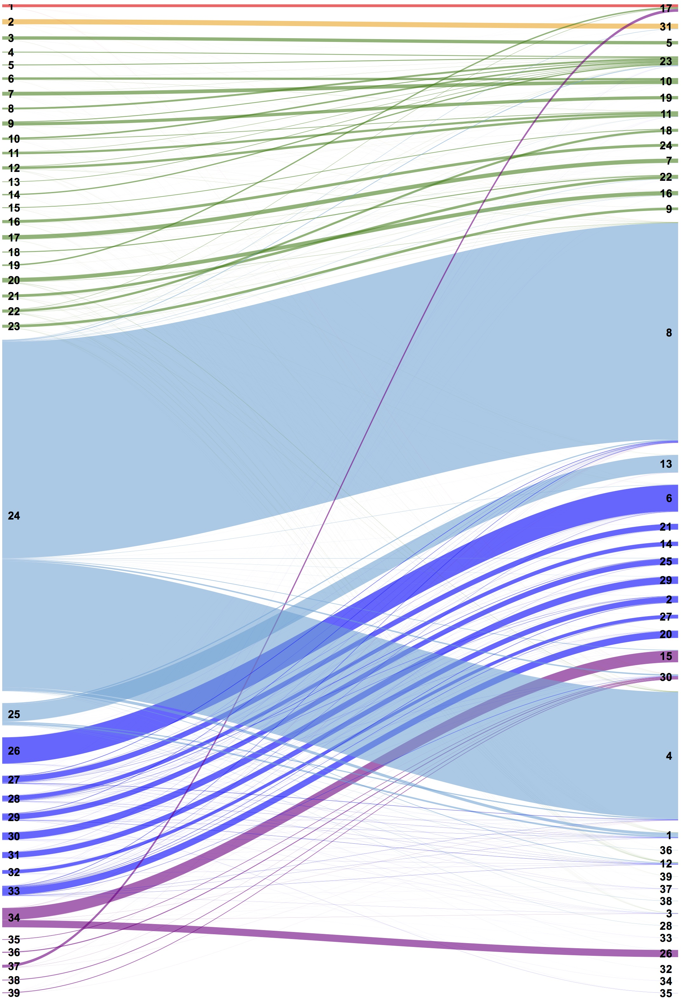

### Fig. S6
[data_b](data/S6b.csv)  
[data_c](data/S6c.csv)  
[script](S6.R)  
[pdf](pdf/S6.pdf)  

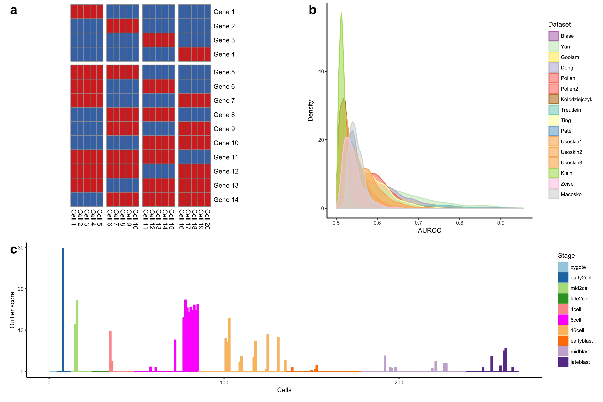

### Fig. S7
[data_a1](data/S7a1.csv)  
[data_a2](data/S7a2.csv)  
[data_b1](data/S7b1.csv)  
[data_b2](data/S7b2.csv)  
[script](S7.R)  

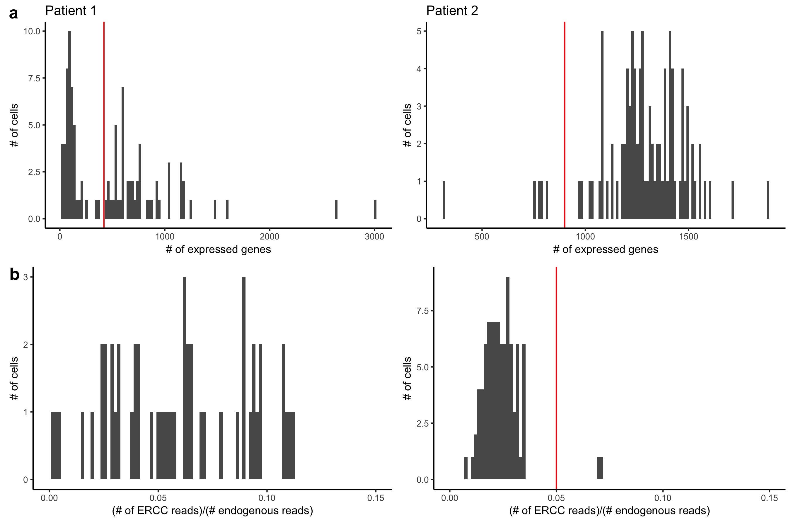

### Fig. S12
[data_a](data/S12a.csv)  
[script](S12.R)  
[pdf](pdf/S12.pdf)

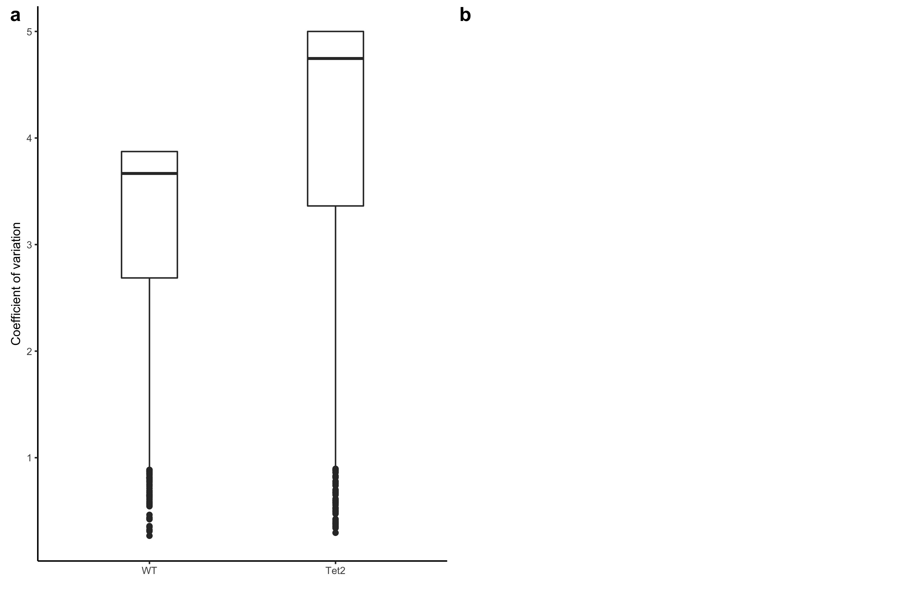

## Session Info

```
R Under development (unstable) (2016-10-20 r71540)
Platform: x86_64-apple-darwin13.4.0 (64-bit)
Running under: OS X Yosemite 10.10.5

locale:
[1] en_GB.UTF-8/en_GB.UTF-8/en_GB.UTF-8/C/en_GB.UTF-8/en_GB.UTF-8

attached base packages:
[1] stats     graphics  grDevices utils     datasets  methods   base     

other attached packages:
[1] pheatmap_1.0.8  googleVis_0.6.1 dplyr_0.5.0     cowplot_0.7.0   ggplot2_2.2.1  

loaded via a namespace (and not attached):
 [1] Rcpp_0.12.8        codetools_0.2-15   assertthat_0.1     grid_3.4.0         plyr_1.8.4        
 [6] R6_2.2.0           jsonlite_1.1       gtable_0.2.0       DBI_0.5-1          magrittr_1.5      
[11] scales_0.4.1       lazyeval_0.2.0     RColorBrewer_1.1-2 tools_3.4.0        munsell_0.4.3     
[16] colorspace_1.3-1   tibble_1.2
```
